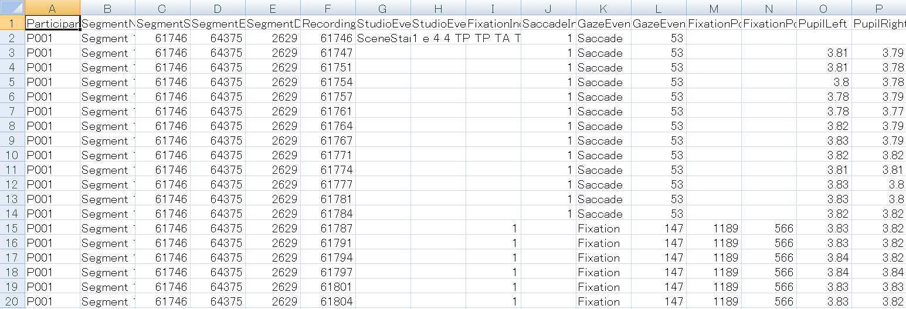

<!---
```bash
pandoc -V documentclass=ltjarticle -V geometry:margin=1in --number-sections --latex-engine=lualatex --filter pandoc-citeproc data-trimming.md -o data-trimming.pdf
```
-->

# data trimming

　最終的に得たいデータは以下の構造を持ちます。つまり、被験者番号、アイテム番号、fixation座標、gazeのtimestanp、などなどを含みます。

```csv
"ParticipantName","SegmentName","FixationPointX","FixationPointY","GazeStart","GazeEnd","hoge","piyo","ItemNo","Condition","AOI1","AOI2","AOI3","AOI4","AOI"
"P05","Segment 1",839,446,88,188,"1","3","6","d","A","D","C","B",1
"P05","Segment 1",927,449,215,368,"1","3","6","d","A","D","C","B",1
"P05","Segment 1",589,340,425,575,"1","3","6","d","A","D","C","B",1
"P05","Segment 1",417,256,615,801,"1","3","6","d","A","D","C","B",1
"P05","Segment 1",424,181,831,1048,"1","3","6","d","A","D","C","B",1
```

　一方、Tobiiから吐き出されるデータは以下の構造を持ちます。
これはディレクトリの中身を見て確認してください。  
<!--  -->
```tsv
ParticipantName SegmentName     SegmentStart    SegmentEnd      SegmentDuration RecordingTimestamp      StudioEvent     StudioEventData FixationIndex   SaccadeIndex    GazeEventType   GazeEventDuration       FixationPointX (MCSpx)  FixationPointY (MCSpx)  PupilLeft       PupilRight      
P05     Segment 1       51212   61655   10443   51212   SceneStarted    1 3 6 d A D C B         1       Saccade 63                                      
P05     Segment 1       51212   61655   10443   51213                           1       Saccade 63                      1.54    2.42    
P05     Segment 1       51212   61655   10443   51217                           1       Saccade 63                      1.70    2.00    
P05     Segment 1       51212   61655   10443   51220                                   Unclassified    3                       2.14    2.05    
P05     Segment 1       51212   61655   10443   51223                           2       Saccade 10                      1.59    2.05    
P05     Segment 1       51212   61655   10443   51227                           2       Saccade 10                      1.53    2.03    
P05     Segment 1       51212   61655   10443   51230                           2       Saccade 10                      2.05    2.02    
P05     Segment 1       51212   61655   10443   51233                                   Unclassified    3                       1.53    2.05    
P05     Segment 1       51212   61655   10443   51237                           3       Saccade 63                      1.85    2.03    
P05     Segment 1       51212   61655   10443   51240                           3       Saccade 63                      1.66    2.03    
```

StudioEvent のデータを振ったり、AOIを割り出したりしています。

## ファイルリスト

処理を一度に行うために、ファイルリストを作成する。  
<!--    -->

```tree
.
├── csv
│   └── output.csv
├── main
│   ├── csv
│   │   └── output.csv
│   ├── npi_2017_New test_Rec 05_Segment 1.tsv
│   ├── npi_2017_New test_Rec 05_Segment 10.tsv
│   ├── npi_2017_New test_Rec 05_Segment 11.tsv
│   ├── npi_2017_New test_Rec 05_Segment 12.tsv
│   ├── npi_2017_New test_Rec 05_Segment 13.tsv
│   ├── npi_2017_New test_Rec 05_Segment 14.tsv
│   ├── npi_2017_New test_Rec 05_Segment 15.tsv
│   ├── npi_2017_New test_Rec 05_Segment 16.tsv
│   ├── npi_2017_New test_Rec 05_Segment 17.tsv
│   ├── npi_2017_New test_Rec 05_Segment 18.tsv
│   ├── npi_2017_New test_Rec 05_Segment 19.tsv
│   ├── npi_2017_New test_Rec 05_Segment 2.tsv
│   ├── npi_2017_New test_Rec 05_Segment 20.tsv
│   ├── npi_2017_New test_Rec 05_Segment 21.tsv
│   ├── npi_2017_New test_Rec 05_Segment 22.tsv
│   ├── npi_2017_New test_Rec 05_Segment 23.tsv
:
```

眼球運動データは Tobii Studio から吐き出す際、
project名＋test名＋被験者名＋segment名で自動保存されます。
パターンを指定してリスト data_list に読みこみます。

```R

# 作業ディレクトリの決定
getwd()
setwd("/home/kishiyama/home/thesis/npi-thesis/result/main")

# 今回の実験は npi_2017 という名前でおこないました。
file_pattern <- "npi_2017_New test"
data_list <- list.files(pattern = file_pattern)

if (length(data_list) == 0){
    print('you might want to make some changes')
    # もし一つも読み込めていなかったら file_pattern かパスがおかしい
}else{
    print('loaded')
}
```


## fixationの入ってないデータを取り除く


取り除くべきファイルを取り除かないと、エラーが吐かれる。この点に例外処理を行いたい。可読性を下げない範囲で。
あるいは、main の前にもう一度チェックするとか。関数化して。

```R
# data_list に対して以下の動作を繰り返し実行する。

# init the number of bad trials
bad_trials = 0

# 原始的ですが、デバッグをするときはリストをindexで指定して一つのファイルで動作を確認すると楽です。
# for(file_name in data_list[1]){
for(file_name in data_list){
    trial <- read.table(file_name, head=T, sep="\t", na.string="NA", encoding="UTF-8")
    fixations_in_trial <- trial[trial$GazeEventType == "Fixation",]
    if (nrow(fixations_in_trial) == 0){
        print(paste("Bad trial!", file_name))
        bad_trials = bad_trials + 1
    }
}

if (bad_trials == 0){
    print("there's no bad trial!")
}
```


## 全員分のデータを一つのファイルにまとめる


一つのファイルに対する作業

0. ファイル名を読み込んで data.frame を返す。
1. data.frame を入力に、Timestampを加えたり、カラムを削ったりの修正を行った data.frame を返す。
1. data.frame を入力に、同じFixationになっている時間帯を一つの行にまとめる。
1. E-prime情報を区切ってdata_with_gaze_flagの右側に(StudioEventDataの隣から)マッピングする。

以上の関数を順番にfor文で全てのファイルに適用します。


### 必要な関数を定義


0. ファイル名を読み込んで data.frame を返す関数の定義


```R

# object: ファイル名を読み込んで data.frame を返す
# input ： string
    # name of the file
# return: data.frame
    #[1] "ParticipantName"        "SegmentName"            "SegmentStart"           "SegmentEnd"             "SegmentDuration"        "RecordingTimestamp"    
    #[7] "StudioEvent"            "StudioEventData"        "FixationIndex"          "SaccadeIndex"           "GazeEventType"          "GazeEventDuration"     
    #[13] "FixationPointX..MCSpx." "FixationPointY..MCSpx." "PupilLeft"              "PupilRight"             "X"
# error: "encoding="UTF-8"指定、 "na.string"で空欄にNAを挿入。    

getDataFrameFromFileName <- function(file_name){
    data_frame <- read.table(file_name, head=T, sep="\t", na.string="NA", encoding="UTF-8")
    return(data_frame)
}
```


1. data.frame を入力に、Timestamp を加えたり、StudioEventData を削ったりの修正を行った data.frame を返す関数の定義


```R

# object: data.frameの 一次整形
# input : data.frame
    # ParticipantName, SegmentName,
        # SegmentStart, SegmentEnd, SegmentDuration, RecordingTimestamp, StudioEvent, StudioEventData,
    # FixationIndex,
        # SaccadeIndex,
    # GazeEventType, GazeEventDuration
    # FixationPointX..MCSpx., FixationPointY..MCSpx.,
        # PupilLeft, PupilRight, X
# return : data.frame
    # ParticipantName, SegmentName,
    # FixationIndex,
    # GazeEventType, GazeEventDuration,
    # FixationPointX FixationPointY
    # Timestamp
    # TODO 結局 Timestamp ってなに？
# error
    # TODO　この関数に例外処理をあてます
    # undefined columns selected が順当かと。

refineRawDataFrame <- function(raw){

    selected_column <- raw[,c("ParticipantName", "SegmentName", "SegmentStart", "SegmentEnd", "SegmentDuration",
        "RecordingTimestamp", "FixationIndex", "SaccadeIndex", "GazeEventType", "GazeEventDuration",
        "FixationPointX..MCSpx.", "FixationPointY..MCSpx.", "PupilLeft", "PupilRight")]

    renamed_column <- NULL
    colnames(selected_column) <- c("ParticipantName", "SegmentName", "SegmentStart", "SegmentEnd", "SegmentDuration",
        "RecordingTimestamp", "FixationIndex", "SaccadeIndex", "GazeEventType", "GazeEventDuration",
        "FixationPointX", "FixationPointY", "PupilLeft", "PupilRight")
    renamed_column <- selected_column

    # 反応時間の間隔を算出。
    # SegmentStart: trialの開始点
    # RecordingTimestamp: recording point の時間点
    column_with_timestamp <- NULL
    renamed_column$Timestamp <- renamed_column$RecordingTimestamp - renamed_column$SegmentStart
    column_with_timestamp <- renamed_column

    # いらないカラムを削除(2回目)
    # ~~SegmantStart, SegmentEnd, SegmentDuration, RecordingTimestamp, PupilLeft, PupilRight~~
    selected_column <- column_with_timestamp[,c("ParticipantName", "SegmentName", "FixationIndex",
        "GazeEventType", "GazeEventDuration", "FixationPointX", "SaccadeIndex", "FixationPointY", "Timestamp")]

    # GazeEventType (Unclassified, Fixation, Saccade)から
    # FixationとSaccadeだけを取り出す。
    selected_column <- selected_column[selected_column$GazeEventType != "Unclassified",]

    # NA をなんとしても潰す
    # FixationIndex が NA である場合 FixationIndex に SaccadeIndex を格納する。
    selected_column$FixationIndex <- ifelse(is.na(selected_column$FixationIndex),
        selected_column$SaccadeIndex,
        selected_column$FixationIndex)

    #確認しやすくするため、全てのNAを-1に変換
    # TODO: -1 は想定内らしい。本当に？
    # 画面外を見ていた、ってことかな。
    selected_column$FixationPointX <- ifelse(is.na(selected_column$FixationPointX),
        -1,
        selected_column$FixationPointX)

    selected_column$FixationPointY <- ifelse(is.na(selected_column$FixationPointY),
        -1,
        selected_column$FixationPointY)

    #Indexの情報を全てFixationIndexにまとまっているため、
    #SaccadeIndexは削除する。
    selected_column$SaccadeIndex <- NULL
    refined_column <- selected_column

    return(refined_column)
}
```


2. 同じFixationになっている時間帯を一つの行にまとめる。


```R

# object: 同じFixationになっている時間帯を一つの行にまとめる。
# input : data.frame (refined_data_frame)
    # ParticipantName, SegmentName, FixationIndex,
    # GazeEventType, GazeEventDuration,
    # FixationPointX FixationPointY Timestamp

# return: data.frame (data_with_gaze_flag)
    # ParticipantName, SegmentName, FixationIndex,
    # GazeEventType, GazeEventDuration,
    # FixationPointX, FixationPointY,
    # GazeStart, GazeEnd

addGazeFlag <- function(refined_data){
    # 同じ Fixation になっている時間帯の終了時間を min で算出して、新しいオブジェクトの min_table にまとめます
    min_table <- aggregate(
        x = refined_data$Timestamp,
        by = list(refined_data$ParticipantName, refined_data$SegmentName,
            refined_data$FixationIndex,refined_data$GazeEventType, refined_data$GazeEventDuration,
            refined_data$FixationPointX, refined_data$FixationPointY),
        FUN = min
    )

    colnames(min_table) <- c("ParticipantName", "SegmentName", "FixationIndex",
        "GazeEventType", "GazeEventDuration", "FixationPointX", "FixationPointY", "GazeStart")
    min_table <- min_table[order(min_table$ParticipantName,
    min_table$SegmentName, min_table$GazeStart),]

    # 同じ Fixation になっている時間帯の終了時間を max で算出して、新しいオブジェクトの max_table にまとめます
    max_table <- aggregate(
        x = refined_data$Timestamp,
        by = list(refined_data$ParticipantName, refined_data$SegmentName, refined_data$FixationIndex,
        refined_data$GazeEventType, refined_data$GazeEventDuration,
        refined_data$FixationPointX, refined_data$FixationPointY),
        FUN = max
    )

    colnames(max_table) <- c("ParticipantName", "SegmentName", "FixationIndex",
        "GazeEventType", "GazeEventDuration", "FixationPointX", "FixationPointY", "GazeEnd")
    max_table <- max_table[order(max_table$ParticipantName,
        max_table$SegmentName, max_table$GazeEnd),]

    # min_table をベースにして、max_table から "GazeEnd" 列だけを取り出して cbind する
    data_with_gaze_flag <- cbind(min_table, max_table[,8])

    colnames(data_with_gaze_flag) <- c("ParticipantName", "SegmentName", "FixationIndex",
        "GazeEventType", "GazeEventDuration",
        "FixationPointX", "FixationPointY",
        "GazeStart", "GazeEnd")

    return(data_with_gaze_flag)
}
```

3. E-prime情報を区切ってdata_with_gaze_flagの右側に(StudioEventDataの隣から)マッピングします。


```R

# input1： string
    # name of the file
# input2:data.frame(with StudioEventData)
    #[1] "ParticipantName"        "SegmentName"            "SegmentStart"           "SegmentEnd"             "SegmentDuration"        "RecordingTimestamp"    
    #[7] "StudioEvent"            "StudioEventData"        "FixationIndex"          "SaccadeIndex"           "GazeEventType"          "GazeEventDuration"     
    #[13] "FixationPointX..MCSpx." "FixationPointY..MCSpx." "PupilLeft"              "PupilRight"             "X"
# input3: integer
    # number of columns
# return: data.frame (with E-prime情報)
    #[1] "ParticipantName"   "SegmentName"       "FixationIndex"     "GazeEventType"     "GazeEventDuration" "FixationPointX"    "FixationPointY"    "GazeStart"           
    #[9] "GazeEnd"              "StudioEventData"   "ListNo"            "Condition"         "ItemNoA"           "ItmeNoB"           "C1Type1"           "C1Type2"          
    #[17] "C2Type1"           "C2Type2"           "SoundType"         "TrialOrFiller"     "Picture"           "Sound"             "CorrectAnswer"     "AOI1"             
    #[25] "AOI2"              "AOI3"              "AOI4"              "AOI5"              "AOI6"              "AOI7"              "AOI8"              "TypeTag1"         
    #[33] "TypeTag2"          "TypeTag3"          "TypeTag4"          "TypeTag5"          "TypeTag6"          "TypeTag7"          "TypeTag8"          "LocationTag1"     
    #[41] "LocationTag2"      "LocationTag3"      "LocationTag4"      "LocationTag5"      "LocationTag6"      "LocationTag7"      "LocationTag8"

addStudioEventData <- function(file_name, data_with_gaze_flag, numcol) {
    # E-prime から Tobii に送る信号は StudioEventData に記録される
    # それを取り出して別の object にしておいて後で区切ｒｙ
    # str と　int　の　2 levels となる。
    # excel などだと2行目だが、head=T で読んでいるので1行目は head 扱い。
    raw_data_frame <- getDataFrameFromFileName(file_name)
    eventdata <- raw_data_frame[1,]$StudioEventData

    #文字形式（Factorでも数値でもない）に変換して data_with_gaze_flag に加える
    data_with_gaze_flag$StudioEventData <- as.character(eventdata)
    # ここでaddしたStudioEventDataはnullしないの？ ←次のステップでします。

    # E-prime情報を空白で区切ってlistにまとめる。
    # うまくデータが読み込めているかを確認するための unlist
    list_of_eventdata <- unlist(strsplit(data_with_gaze_flag$StudioEventData, " "))

    # list　の行数が numcol の倍数でければエラー。
    # numcol = 8
    if (length(list_of_eventdata)/numcol != nrow(data_with_gaze_flag)) {
        print(paste("Bad trial!", file_name))
    }

    # matrix()関数を使って、一列しかなかった list を8ずつ切って横にして、表にします。
    mat <- matrix(list_of_eventdata , nrow = nrow(data_with_gaze_flag), ncol = numcol, byrow=T)
    mat <- as.data.frame(mat)

    #matにコラム名を付け加えます。
    colnames(mat) <- c("hoge", "piyo", "ItemNo", "Condition",
        "AOI1", "AOI2", "AOI3", "AOI4")  

    #temp2(Tobii)とmat(E-prime)を合併します。
    data_with_eventdata <- cbind(data_with_gaze_flag, mat)

    return(data_with_eventdata)
}
```

### 実行部分

tempを使わないように書き換える。

```R

#initialize

#必要なpackage #cast(), melt()などデータの分解、横/縦立て直し
library(reshape)

#処理した全員分のデータをループ式で足していく
data_all <- NULL

# E-prime から Tobii に送る信号の項目数を先に指定しておく。
# 実験デザイン時に必要な項目を指定する
numcol = 8
    #実際には36項目だけど、36項目がまとまった StudioEventData というカラムも足して37
    #Tobiiから吐き出したtextファイルの中StudioEvent欄を回収する。
    #実験内容に応じてコラム数を変更する必要がある。
    #("list", "trial", "itemA", "itemB", "cond",
    #"AOI1", "AOI2", "AOI3", "AOI4", "AOI5", "AOI6", "AOI7", "AOI8"…..))

# なぜか変なデータ形式が混ざっていることがある。
for(n in 1:length(data_list)){
    #何ファイル目を処理しているかをプリントする。
    print(paste("now access to", n))
    # バグが出たらどこで止まっているのかたどり着くことができる。
    # 関数を呼び出すごとに例外処理したい。したくない？

    # 0
    # ファイル名を読み込んで data.frame を返す
    raw_data_frame = getDataFrameFromFileName(data_list[n])

    # 1
    # data.frameの 一次整形
    refined_data_frame = refineRawDataFrame(raw_data_frame)
    #print(head(refined_data_frame, 10))

    # 2
    # 同じFixationになっている時間帯を一つの行にまとめます。
    data_with_gaze_flag = addGazeFlag(refined_data_frame)
    #head(data_with_gaze_flag, 10)

    # 3
    # E-prime情報を区切って data_with_gaze_flag の右側にマッピングします。
    data_with_eventdata = addStudioEventData(data_list[n], data_with_gaze_flag, numcol=8)

    #できたデータを一人分ずつdata_allの下から付け加える。
    data_all <- rbind(data_all, data_with_eventdata)
}
```

## 注視点のXY座標をAOIにマッピングする

AOIにマッピングして保存

```R

# グローバル変数に data_all がある状態。

# 1080*1920の画面を８分割にする。
#  1  2
#  3  4
# TODO ここでなぜか 0 が起きている
# -1 と振られた奴が。
data_all$AOI <- ifelse(data_all$FixationPointX >= 0 & data_all$FixationPointX < 960
    & data_all$FixationPointY >= 0 & data_all$FixationPointY < 540,
    1,
    0)
data_all$AOI <- ifelse(data_all$FixationPointX >= 960 & data_all$FixationPointX < 1920
    & data_all$FixationPointY >= 0 & data_all$FixationPointY < 540,
    2,
    data_all$AOI)
data_all$AOI <- ifelse(data_all$FixationPointX >= 0 & data_all$FixationPointX < 960
    & data_all$FixationPointY >= 540 & data_all$FixationPointY < 1080,
    3,
    data_all$AOI)
data_all$AOI <- ifelse(data_all$FixationPointX >= 960 & data_all$FixationPointX < 1920
    & data_all$FixationPointY >= 540 & data_all$FixationPointY < 1080,
    4,
    data_all$AOI)

#Fixationだけを残す。Saccadeのデータも削除（XY軸の情報がない）。
# この段階ですでに GazeEventType が落ちているようにみえるけど。
data_with_fixation <-data_all[data_all$GazeEventType == "Fixation",]

# 必要のない情報を削除する。
data_with_fixation$GazeEventDuration <- NULL
data_with_fixation$StudioEventData <- NULL
data_with_fixation$FixationIndex <- NULL
data_with_fixation$GazeEventType <- NULL

# 確認
#head(data_with_fixation)

# データ全体のバランスを確認します。
table(data_with_fixation$ParticipantName, data_with_fixation$SegmentName)

# csvで保存
write.csv(data_with_fixation, "./csv/output.csv", row.names=F)
```
